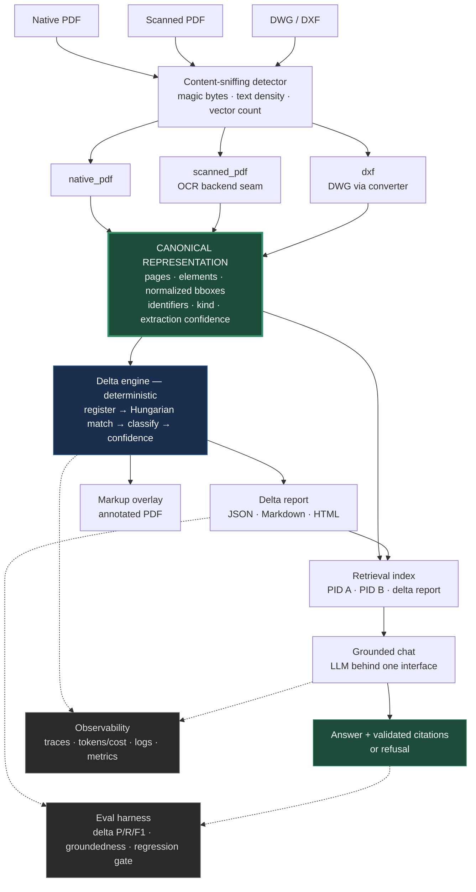

# Document Delta & Grounded Chat

Takes two document revisions, computes a **structured delta** between them, renders a **delta report**, and answers questions grounded in both revisions and that report **with validated citations**.

Native PDF, scanned PDF, and CAD all ingest through one adapter interface into a single **canonical representation**. The delta engine is deterministic; the LLM is confined to answer synthesis.

| | |
|---|---|
| **Walkthrough (3½ min)** | **<https://youtu.be/A4WmxZW6JNU>** — delta, grounded chat, refusal, trace, scorecard |
| **Live demo** | <https://pathnovo-ievadaslya-el.a.run.app> (allow 30–60s cold start) |
| **Run everything** | `python scripts/verify.py` — ~60s, no `make` required |
| **Stack** | Python · FastAPI · React (Vite) · Docker · Cloud Run |

**The honest headline.** Three formats run end-to-end, the delta engine does real alignment rather than text diffing, and the evaluation is falsifiable. But the committed chat metrics grade a deterministic **extractive** provider — **nothing in this repo evaluates hosted-LLM synthesis or hallucination.** The live demo runs Groq; the scorecard does not. That distinction is kept explicit throughout.

---

## Contents

| Question | Section |
|---|---|
| Can I just watch it work? | [Walkthrough video](https://youtu.be/A4WmxZW6JNU) (3½ min) or the [live demo](https://pathnovo-ievadaslya-el.a.run.app) |
| How do I run it? | [Running it](#running-it) |
| How is content aligned between revisions, and where does it break? | [Alignment](#alignment--the-hard-part) |
| Where is the LLM, and where is it deliberately not? | [Where the LLM is, and is not](#where-the-llm-is-and-is-not) |
| What does a failed request look like? | [Failure visibility](#failure-visibility) · [`docs/failure-traces/`](docs/failure-traces/) |
| Can the eval detect a regression? | [Eval integrity](#eval-integrity) |
| What doesn't work? | [Where it fails](#where-it-fails) |
| What did you cut, and what's next? | [Deliberate cuts](#deliberate-cuts) · [What I'd do next](#what-id-do-next) |

---

## Running it

```bash
python -m venv .venv
.venv/bin/pip install -e ".[dev]"      # Windows: .\.venv\Scripts\pip
python scripts/verify.py               # samples → lint → types → tests → frontend → eval → regression check
```

`scripts/verify.py` is the single command that works everywhere. It runs the same chain as `make verify` through the current interpreter, because `make` is absent from a stock Windows install and that is where this gets reviewed. It fails fast with the step name. `--quick` skips the frontend and eval steps.

**No system binaries are required.** OCR runs on pip-installed ONNX weights (RapidOCR); CAD on pure-Python `ezdxf`.

```bash
make demo                 # build React, serve http://127.0.0.1:8000
docker compose up --build # same, containerised
make eval                 # scorecard + failure table + cost/latency budget
make eval-compare         # diff against committed baseline; non-zero on regression
make failure-traces       # regenerate the committed failure traces
```

```bash
delta-chat run-pair --pid-a PID-SYN-A --pid-b PID-SYN-B     # native PDF
delta-chat run-pair --pid-a PID-CAD-A --pid-b PID-CAD-B     # CAD (DXF)
delta-chat chat --run-id <id> -q "What changed near 26-PIT-9062?"
```

**Docker.** Multi-stage: Node builds React, the Python image installs both OCR backends plus CAD support and pre-warms the ONNX models so the first scanned request is not slow. Runs unprivileged as uid 1000 and honours `PORT`. Verified: 2.01 GB image, healthy in ~10s, a full CAD pair and grounded chat exercised inside the container. Hosting options and resource floors are in [DEPLOY.md](DEPLOY.md) — a 512 MB free tier will OOM.

**About the live demo.** Chat there runs Groq `openai/gpt-oss-20b` through LiteLLM (answers are labelled `litellm` in the UI) — *not* the repo default. Its Evaluation tab shows the committed baseline, not a live run, because Cloud Run artifacts are ephemeral. There is no upload endpoint; every route resolves PIDs from bundled synthetic samples, which is why an unauthenticated demo is safe.

---

## What is implemented

| Area | Status |
|------|--------|
| Native PDF adapter (block/line spans) | **End-to-end** |
| Scanned PDF + OCR | **End-to-end** — pluggable backend, RapidOCR default, Tesseract optional |
| CAD adapter (DXF) | **End-to-end** via `ezdxf` — entities, layers, blocks, dimensions |
| DWG | **Seam is real** — same adapter, converts to DXF via external converter; explicit typed error without one |
| Deterministic delta engine | Registration → Hungarian matching → classification + confidence |
| Pair-mismatch detection | Implemented (`warn` / `strict` / `force`) |
| Reports (JSON + MD + HTML) & markup overlay | Implemented |
| Hybrid retrieval + grounded chat | Citation validation, spatial re-rank, refusal on unsupported |
| Traces · structured logs · LLM telemetry · metrics | Implemented |
| Eval harness with gates | `fail_on_gate: true` |
| Regression comparison across runs | `make eval-compare` vs committed baseline |
| Cost/latency budget analysis | In every scorecard, per-stage p50/p95 vs budget |

---

## Results

Reproduce with `make eval`.

| Metric | Value |
|---|---|
| Native delta F1 | **0.923** |
| Scanned delta F1 | **0.923** |
| CAD delta F1 | **0.833** |
| Pair mismatch accuracy | **1.00** |
| Retrieval recall@5 | **0.833** (6 queries, 5 semantic) |
| Chat fact accuracy | **1.00** (18 Q&A) |
| Citation groundedness | **1.00** (assertable on 9 of 18) |
| Unsupported refusal accuracy | **1.00** (7, incl. 3 near-miss traps) |
| All gates passed | **true** |

Several of these read 1.00 for a while because the dataset could not make them fail. Sample sizes and what each metric can actually falsify matter more than the number — see [Eval integrity](#eval-integrity).

---

## Architecture



The **canonical representation** is the load-bearing seam: normalized top-left bounding boxes, extracted identifiers, kind classification, and an extraction confidence. Nothing downstream knows whether a page came from a vector PDF, a raster scan, or a CAD modelspace.

The evidence that it holds: **adding the CAD adapter required no change to the delta engine, retrieval, or chat.** That is the closest thing to proof available short of adding a fourth format.

---

## Design decisions & trade-offs

### Alignment — the hard part

Diffing is trivial once you know which element in A corresponds to which in B. Establishing that correspondence is the whole problem, and it runs in three stages.

**1. Put both pages in one coordinate frame.** A rescan is never pixel-aligned with its original. ORB features plus RANSAC estimate an affine transform from A to B; if too few inliers survive, ECC intensity alignment takes over. The result is validated for plausibility — a determinant or scale far from 1 means the estimate is wrong, and confidence is capped so downstream stages distrust it rather than acting on a bad warp. Registration confidence propagates into every change's confidence.

**2. Match elements globally, not greedily.** Every plausible pair is scored on five signals: identifier overlap (an equipment tag is near-decisive), text similarity blending token-set and character ratios, spatial IoU and centroid distance after transform, kind compatibility, and relative size. Pairs are assigned by **Hungarian assignment over the cost matrix**, not nearest-neighbour — greedy matching lets one confident pair steal an element another needed more, and the error cascades. A radius gate keeps the matrix tractable, with an identifier override so a tag that moved across the sheet can still match.

**3. Classify what the match means.** A matched pair becomes `unchanged`, `moved` (centroid shifted, content equal), `modified`, or `moved_modified`. Numeric tokens are compared separately from fuzzy text similarity so `12000 → 12500` can never be absorbed as noise. Unmatched A elements are `removed`, unmatched B `added`. Residual pixel differences no semantic change explains become `geometry_region` changes — that path catches an added pipe branch carrying no text.

**Where it breaks.** Registration is the weak link: it assumes one sheet per page and a global affine relationship. A drawing re-laid-out between revisions violates that and the matcher degrades into add/remove pairs. The defence is to reject low-confidence registration rather than trust it — honest, but it declines to help exactly when the comparison is hardest. Identifier-poor content (unlabelled geometry) matches on spatial and size signals alone and is correspondingly weaker.

### Where the LLM is, and is not

The delta engine is **fully deterministic** — same inputs, same `delta.json`. Alignment is a matching problem with exact coordinates available, and a deterministic solver is reproducible, free, and explainable. An LLM there would buy nothing and cost reproducibility.

The LLM earns its place in **answer synthesis only**. Every citation is validated against the retrieval index before an answer returns; unknown IDs raise, and unsupported claims are dropped. Default `LLM_PROVIDER=extractive` is a no-key deterministic baseline; the LiteLLM path (`pip install '.[llm]'`) swaps in any hosted provider. Token cost reports as **unavailable**, never `0.00`, unless a provider returns a real figure.

### Format detection

Content-sniffed, not extension-based: DWG by `AC10xx` magic, DXF by its `SECTION` header or binary sentinel, PDF routed to native vs scanned by text density, vector count, and image coverage.

### OCR backend seam

`config.ocr.backend` selects `auto` | `rapidocr` | `tesseract`. `auto` walks `backend_priority` and takes the first available; an explicit name **never** silently falls back, because comparing engines is worthless if you cannot tell which one ran. Backends declare a `granularity` — Tesseract emits words needing grouping, RapidOCR emits lines already, and re-grouping those was actively harmful (see [Where it fails](#where-it-fails)).

---

## Observability

Every run writes to `artifacts/runs/<request_id>/`:

| File | Contents |
|---|---|
| `trace.json` | Spans with per-stage timings; chat spans carry the parent run's correlation id |
| `events.jsonl` | Structured JSON logs with request/correlation ids |
| `llm_calls.jsonl` | Model, token counts, cost; prompt/response content only when `capture_content` is on |
| `metrics.json` | Stage latency, delta counts, chat requests, refusals, errors by type |
| `errors.jsonl` | Typed errors with stable codes and actionable details |

`GET /api/health` reports which format capabilities are actually usable, so a degraded deployment is visible without submitting a document.

**Homegrown rather than OpenTelemetry.** The whole surface is one process and a handful of stages; a tracer I wrote is one file I can point at rather than a collector to stand up. The span shape is deliberately OTel-compatible so swapping the writer stays a contained change.

### Failure visibility

Traces live under gitignored `artifacts/`, so a fresh clone would show no evidence failures are handled at all. Three real ones are committed in **[`docs/failure-traces/`](docs/failure-traces/)** — produced by running the pipeline, not hand-written:

| Case | Raised |
|---|---|
| Two unrelated drawings, strict mode | `PairMismatchError` — with score, threshold, and the reasons it refused |
| DWG with no converter installed | `UnsupportedFormatError` — names the missing dependency and the config key |
| Unresolvable PID | `PidNotFoundError` |

The failing span carries `"status": "error"` while earlier spans keep their timings, so you can see how far the request got.

---

## Evaluation

`make eval` runs labeled cases (native, scanned, CAD, pair-mismatch) covering delta P/R/F1 against ground truth, retrieval recall@5, chat fact accuracy, citation groundedness, and refusal accuracy — then applies gates and exits non-zero on breach.

**Regression detection.** `make eval-compare` diffs the latest scorecard against committed `eval/baseline.json`, direction-aware per metric with per-metric tolerances. It flags a metric that *disappeared* — a case that silently stopped running otherwise looks like a clean scorecard. Scorecards carry a `dataset_hash`, so a harder test set is reported as *not attributable* rather than as a system regression.

**Budgets.** Each scorecard carries per-stage p50/p95/max against declared budgets. Not decoration — it found a real bug. Markup overlay ran at **9.7s p95** against a 2s budget. My first guess was preview rasterization; measuring showed that took 0.05s. The real cause was per-change PDF writes — `new_shape()`/`commit()` and `insert_text()` each emit their own content stream at ~15ms apiece, invisible on a 6-change pair and ruinous on the 624-change mismatch pair. Batching by style and routing labels through one `TextWriter` took it to **296ms p95**, 33× faster, and end-to-end p95 from 13.4s to 6.5s.

### Eval integrity

An external review found most of the perfect scores were properties of the test set rather than of the system. That critique was correct, and acting on it moved real numbers.

| Defect | What it meant | Now |
|---|---|---|
| `citation_validity` was circular | The judge graded citations with `citation_supports_answer` — the same function production used to *discard* failing citations. Every citation it saw had already passed that test, so it could not score below 1.00 | Replaced with `citation_groundedness`: does the cited evidence contain the labelled value? It can and does score 0 |
| Substring fact matching | `"250"` passed against duty `"12500"`; `"185"` against `"1185"`. Wrong answers scored correct | Boundary-aware numeric matching; whitespace-tolerant text matching for OCR |
| Refusal traps were free | Refusal questions used words absent from the corpus (`paint`, `hydrotest`) — retrieval returned nothing, refusing was trivial | Three near-miss traps using vocabulary that *is* present, attached to the wrong entity. **One failed**: asked for the duty in "revision C", the system returned Rev B's value. Fixed with revision-scope checking |
| Tautological retrieval | n=2, both bare instrument tags checked by substring against a lexical retriever | n=6, five phrased semantically. Recall dropped 1.00 → **0.833** — one genuine miss, `"isolation valve on the new branch"` not reaching `HV-205` |
| Metrics that could not fail | 6 of 15 Q&A had `must_include: []` or `unsupported: true` | Reported explicitly: `citation_groundedness_n_measured` says how many were assertable (9 of 18) |

**The chat metrics grade the deterministic `extractive` provider, not a hosted LLM.** Nothing here evaluates real LLM synthesis or hallucination, and `make eval` never touches the LiteLLM path. `retrieval_recall_at_5` is also not recall in the IR sense — there is no labelled relevant set, only an expected-hit assertion per query. It is a smoke test and named for what it approximates.

### Determinism

The engine claims determinism; three places did not honour it, all fixed:

- **RANSAC was unseeded.** `cv2.setRNGSeed` is now called, so registration is reproducible.
- **Citation checking iterated a set.** `list(a)[:8]` over a set of strings follows `PYTHONHASHSEED`, so a different eight tokens were examined every process. Now `sorted`, with a subprocess test across five seeds.
- **`delta_id` hashed only the change count.** Two runs finding the same *number* of entirely different changes produced the same id. Now hashes sorted item ids.

---

## Where it fails

Current, reproduced by `make eval`, and printed as a failure table in every scorecard.

| Failure | Cause | Status |
|---|---|---|
| Scanned + CAD each report 1 FP | An added branch is reported as *two* findings — the geometry region and its valve label (`HV-205`/`HV-305`) — where ground truth labels it as one region | **Labeling granularity, not a detection defect.** The system arguably has this right; I left the labels alone rather than widen one to improve a number |
| CAD 1 FN | Same branch: the matched finding's centroid falls outside the 0.08 location tolerance | Open — scoring should accept either the region or its label |
| Native 1 FP | One low-confidence residual region | Open, low impact |
| Retrieval misses `"isolation valve on the new branch"` | Lexical + spatial retrieval has no synonym knowledge; nothing links "isolation valve" to `HV-205` | Open — the clearest argument for embeddings |
| DWG not end-to-end | No usable open-source DWG reader | **By design** — converter seam with an explicit typed error |
| Dense multi-sheet CAD | Registration assumes one sheet per page | Rejects low-confidence registration rather than guessing |

Four defects were found and fixed during the build. All four were silent, which is why they are worth naming:

- **Inverted ECC registration.** The ECC fallback returned a B→A transform while every consumer treats the matrix as A→B. Verified empirically: for a known `(+7,+4)` shift it returned `(-7,-4)`. It engaged only when ORB had already failed — the low-texture scans — where it roughly *doubled* misalignment. Its confidence was ECC's correlation coefficient, which sits near 1.0 on a 95%-white page regardless of alignment, so the fallback always self-certified. Confidence is now measured on ink pixels only.
- **Residual ink reported twice.** The engine recorded which regions a semantic change explained so the pixel-residual pass could skip them — but recorded only the *new* position of a matched element, and nothing at all for removals. Suppression also used IoU, which cannot see containment: two ink blobs inside an added `NOTE 12` line score far below any usable threshold despite being the same ink. **Scanned F1 0.667 → 0.923**, precision 0.50 → 0.857, native and CAD unchanged — verified by `make eval-compare`, which is what that tool is for.
- **Unstable line grouping.** Fixed-height bucketing of OCR words put identical content in different groups on Rev A and Rev B, manufacturing 4 phantom changes from one region. Replaced with vertical-overlap clustering plus a horizontal-gap break. Scanned F1 0.52 → 0.60.
- **Whitespace-only OCR differences.** `NOTE 10:See package` vs `NOTE10:Seepackage` is the same ink — word segmentation is the recognizer's artifact, not the drawing's. Suppressed for OCR-sourced elements only, and only when whitespace *placement* differs, so `12000 → 12500` is unaffected. Scanned F1 0.60 → 0.667.

A retrieval bug was also fixed: delta records carry their *neighbours'* tags, so in a "what changed near X" query each change anchored on itself and scored perfect proximity. Anchors are now restricted to document elements. Chat fact accuracy 0.93 → 1.00.

---

## Deliberate cuts

- **No vector embeddings.** Originally justified by recall@5 = 1.00 — a figure measured on two bare-tag queries a lexical retriever cannot lose. On semantically phrased queries recall is **0.833**, and the miss (`"isolation valve"` → `HV-205`) is exactly the synonym gap embeddings close. The cut still stands for the time available, but the justification was wrong and is corrected rather than quietly restated.
- **No LLM in the delta path.** Deliberate, not a shortcut — see [Where the LLM is, and is not](#where-the-llm-is-and-is-not).
- **No LLM-as-judge in eval.** Deterministic string and citation checking is shallower but trustworthy. An LLM judge needs its own labelled agreement set before I would rely on it.
- **Single-sheet assumption** in registration and grid estimation.
- **No multi-user auth or persistent storage** — local/demo boundary.

## What I'd do next

1. **Region-level ground truth for geometry changes.** The remaining FP/FN on both scanned and CAD is one problem: an added branch is a *region* in the labels but the system reports the region and its valve label. Scoring should accept either. Worth doing before chasing matcher accuracy, because the metric currently penalises correct behaviour.
2. **Residual stability across registration jitter.** Suppression is now correct for explained ink, but the threshold on unexplained residual is fixed. A stability check across a jittered re-registration would separate real geometry change from raster noise on harder scans.
3. **500-sheet scale.** Everything is per-page and in-memory. That means sheet-level partitioning, a persistent index, and matching restricted to candidate blocks rather than a full cost matrix — the `max_pair_comparisons` guard exists and would trip immediately.
4. **Evaluate the hosted LLM path.** The largest gap. Requires a labelled agreement set for a judge, and a hallucination probe the extractive provider cannot exercise.
5. **Real DWG.** Bundle the ODA converter where licensing permits, with a conversion-fidelity check comparing entity counts before and after.

---

## Repository map

```text
src/delta_chat/
  ingest/      detector · native_pdf · scanned_pdf (ocr/ backend seam) · dxf · dwg
  canonical/   models · coordinates · grouping · limits     ← the seam
  delta/       registration · matching · classify · engine · visual_diff · report
  chat/        llm (provider-agnostic) · citations · prompts · service
  retrieval/   hybrid (exact tag + TF-IDF + RRF + spatial re-rank) · index · records
  markup/      overlay onto Rev B
  observability/ tracing · logging · metrics · llm_telemetry
eval/          run · judges · metrics · matching · budget · compare · baseline.json
data/samples/  three synthetic pairs + provenance
docs/failure-traces/  three committed real failures
tests/         115 tests
```

## Sample provenance

See [`data/samples/README.md`](data/samples/README.md). All three pairs are synthetic and drawn independently per revision — no white-out over hidden text, no edited-file residue. The CAD pair carries the same six-change edit set as the PDF pairs on purpose, so `cad_delta_f1` vs `scanned_delta_f1` isolates extraction error from matching error.

## Security & privacy

- `request_id` matches `[A-Za-z0-9_-]{1,64}`; path traversal rejected
- API responses expose URL paths only, never host filesystem paths
- HTML reports escape extracted text
- LLM content capture is **off by default**; chat logs store hashes and lengths instead
- No secrets committed; `.env.example` documents required vars. Private inputs, `.env`, and artifacts are gitignored and dockerignored
